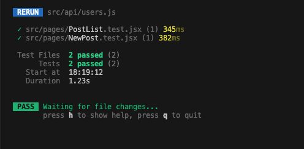

# Before Getting Started

The goal of this project is to practice testing, but more importantly it is about practicing testing properly. The code for this project is nearly identical to the code for our form validation project. I did make a few minor modifications, though, so I would recommend downloading this code or just making the same modifications to your own code. Essentially, the only change I made was to make each form take in an `onSubmit` function that is called with the email/password instead of having those values automatically alerted. This change makes the project a bit more real world for testing purposes.

# Instructions

1. Test the following features of one of the form components (you choose which):
   - Ensure error messages do not show up when submitting a valid form, and that the `onSubmit` function is called with the correct email/password.
   - Ensure error messages show up when submitting an invalid form, and that the `onSubmit` function is not called.
   - Ensure the error messages update when the user changes the input values after the first submit.

## Bonus:

1. Swap out the form component that you used for testing with the other form component in the same test file. All your tests should still pass. If they do not then you most likely are testing implementation details of your component and you should go back and ensure you are only testing how the user interacts with your component.

===============

# Testing
- 41 - Component Testing Project

# Solution OUTPUT

